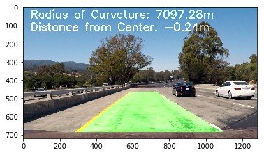

# Advanced Lane Finding Project

The goals / steps of this project are the following:

* Compute the camera calibration matrix and distortion coefficients given a set of chessboard images.
* Apply a distortion correction to raw images.
* Use color transforms, gradients, etc., to create a thresholded binary image.
* Apply a perspective transform to rectify binary image ("birds-eye view").
* Detect lane pixels and fit to find the lane boundary.
* Determine the curvature of the lane and vehicle position with respect to center.
* Warp the detected lane boundaries back onto the original image.
* Output visual display of the lane boundaries and numerical estimation of lane curvature and vehicle position.

## Camera Calibration

First step was to calibrate the camera and undistort the image. To do that, I used multiple chessboard images like the following example:

Ex1:

Ex2:

I used a total of 20 chessboard images. For each one, I used opencv functions like findChessboardCorners to find all the identified corners of the 9x6 chessboard corners existent on each image. This happens on the 2nd and 3rd cell of the python notebook.

Once I had all the corners identified for each image, I used calibrateCamera camera function to get values from the resulted calibration. I used those calibration values as arguments for the opencv undistort function, which provided me the image with corrected camera distortion. See example of images before and after distortion correction:

## Warp to Birdseye View

The next step consisted of determining a transform matrix that I could use to transform the original image (in driver's perspective) into a birdseye view perspective, as with with birdseye we can better determine the curvature of the road. To do this, I used the image that looked to be the most straight as possible. I then identified the points in left and right sides of the lane which the road starts appearing the closest to the car, and their points farther from the car in which they are still visible. After that, I identified the expected coordinates in an image that those points would appear with birdseye. With those sets of points, I used opencv getPerspectiveTransform transform to get the transform matrix, which I could use later with the function warpPerspective. I also created an inverse perspective based on that matrix, so I could use later to perform the inversed process from birdseye to driver's perspective. This happens on the 4th and 5th cell of the python notebook.

### Before Transform

### After Transform

Once I had a birdseye image, I created a function that performed different kind of filter on this image to detect the lines. That function performed different kinds of sobel operations and color thresholding, and each operation would return an image with binary outputs. The operations were the following:

- An operation that would return a binary image of all pixels that matched both vertical and horizontal sobels, or both magnitude and directional thresholds
- An operation that would return a binary of all the pixels in the H layer of an HSV color space that were between the thresholds of 100 and 255
- An operation that would return a binary of all the pixels in the B layer of an RGB color space that were between the thresholds of 0 and 145

I would then filter the result of those 3 operations to only include pixels that were true in at least 2 of those operations. This happens on the 6th and 7th cell of the python notebook. See example below:

Based on that filtered image, I would perform calculations to determine the position of the left and right lines. The first step was to do a histogram calculating the number of occurrences of pixels for each column in the image matrix. I perform that operation on the bottom half of the image. Based on that histogram, if I look for the column with highest value on the left half side of the image, that's likely to be the bottom of the left lane. The same for the right lane. 

Once the base is identified, for each lane (left and right) I divide the image in 10 windows vertically. For each window, I identify the pixels that are within pixels to the left or right of the position of the base identified in the histogram. Once all those pixels on each window are identified, I get the best polynomial fit for all those pixels identified. The polynomial should represent the curvate of the lane. If this step is happening after a frame that has successfully identified lanes, I create a mask based on the previous identified polynomial, with a small margin. That way, for next window searches, I can restrict the margin in which it's looking for pixels. If it fails to find enough pixels within that restricted margin, I fall back into the full window search. This happens on the 8th cell of the python notebook. Here's an example of an image with and without the mask:

### Without Mask:

### With Mask:

### Mask on Image Before Filters

Once both left and right polynomials are estimated, I create a polygon to fill the space between both polynomials, with each polinomial drawing from the base of each lane to about half of the image.

At this point, I have a green polygon that can be overlayed over the road to identify the lane in front of the car, but the perspective is still of a bird eyes view. I then calculate a matrix to calculate the inverse of my previous warp matrix to transform my polygon into the same perspective of the original camera image.

#### Final result:

All this process happens for each frame of the video, that is called from this method.

Here's a [link to my video result](./final_output.mp4)

---

### Discussion

One of my challenges of my current approach is that it is not optimized enough to keep up with the frame rate of a video. I use a 2013 MacBook Pro and the frames/second that it can process is much lower than the number of frames the video contain.

For sake of simplicity, my algorithm only keeps track of the previous identified polynomials. I could have better results if I kept track of additional past measurements and used a more robust algorithm like Kalman filters instead of just a mean calculation between current and previous polynomials.

